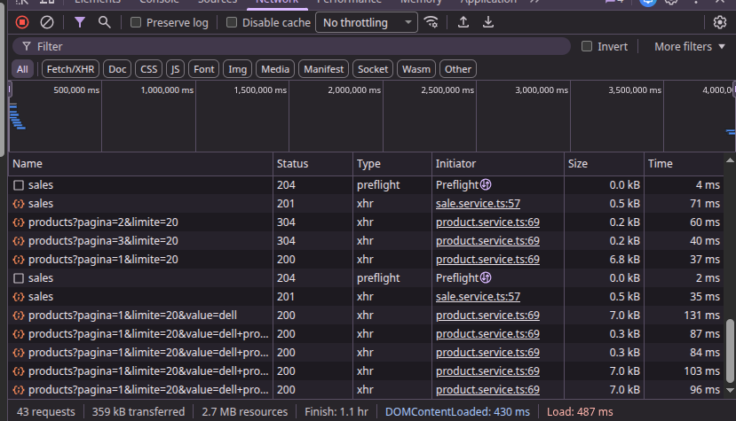

SmartInventory Pro BACK
Prueba tecnica SmartInventory Pro

Problemas a solucionar
#### 1 .Escenario: El producto "TV Samsung" tiene Stock: 1. Dos gerentes intentan descontar 1 unidad en el mismo milisegundo. 

Control de Concurrencia (Optimistic Locking)
- Versionado de productos para prevenir sobreventa
- Manejo de conflictos cuando dos transacciones modifican el mismo producto
- Garantiza integridad del inventario para evitar sobreventas

Ejemplo práctico

Usuario 1 y Usuario 2 realizan un ajuste de stock del producto SKU-000001 al mismo tiempo.

Tanto el Usuario 1 como el Usuario 2, antes de realizar la actualizacion, obtienen el siguiente producto:
{
  _id: ObjectId('697bcff1839b7ec7deca371e'),
  sku: 'SKU-000001',
  name: 'Dell Producto 1',
  description: 'Descripcion detallada del producto 1. Esta es una prueba con 50,000 SKUs para verificar rendimiento.',
  category: 'Accesorios',
  price: 731.09,
  cost: 8.43,
  currentStock: 442,
  reservedStock: 65,
  minStock: 46,
  active: true,
  version: 1,
  __v: 0,
  createdAt: ISODate('2026-01-29T21:24:01.708Z'),
  updatedAt: ISODate('2026-01-29T21:24:34.154Z')
},

Al momento de relizar la venta ambnos usuarios usan la misma version (Version 1), el primer usuario que termina la transaccion verifica que su version concuerda con lo registrado en la base de datos y su transaccion finaliza corerctamente, realiza el descuento de stock/venta e incrementa la version en 1.

Version actual ( 2 )

Cuando el segundo usuario intenta finalizar la transaccion, su version (Version 1) ya no concuerda con lo registrado en la base de datos (Version 2), su transaccion es rechazada y asi evitamos la sobreventa de producto.

#### Test de prueba de concurrencia 
En el archivo test-concurrencia.ts, se ecuentra en scrip para realizar la prueba de concurrencia.

#### Poblar base de datos
Es necesario poblar la bases de datos archivo seed.ts, para realizar el test.
npm run seed
npm rum test-concurrencia.ts

#### 2. Búsqueda Eficiente
- Búsqueda por **nombre** o **SKU** (coincidencia por prefijo, case-insensitive)
- Paginacion con límite máximo de 100 items por página
- Respuesta rápida en catálogos grandes (50,000+ SKUs)

Para mejorar el rendimiento en la busqueda de productos en la base de datos se utilizaron 2 estrategias

1. En caso se esta buscando un producto por su NOMBRE o SKU se hace uso de regex:
{ name: { $regex: /^valor/i } }
{ sku:  { $regex: /^valor/i } }
Esto con el fin de que funcione como autocompletar y adicional se usan indices para hacer mas eficiente la busqueda

2. En caso de buscar todos los productos de la base de datos
- Se usa un limitador de registros por peticion, maximo 100 haciendo uso de limit() y adicionalmente se hace uso de skip() para saltar los productos que ya fueron consultados ejemplo:

Si en mi primera llamada recibo los primero 20 productos, en mi segunda llamada puedo ignorar esos 20 productos haciendo uso de skip(20) y traer los siguientes productos.

#### 3. Arquitectura Clean

src/\
├── config/                     # Configuracion general\
│   └── database/               # Configuracion de conexion a la BD\
│       └── schemas/            # Schemas de las colecciones de la BD\
│\
├── application/\
│   └── use-cases/              # Casos de uso de la aplicacion\
│\
├── domain/\
│   ├── entities/               # Entidades del dominio\
│   └── interfaces/             # Interfaces del dominio\
│\
├── infrastructure/\
│   └── persistence/            # Implementacion de interfaces (MongoDB)\
│\
├── presentation/\
│   └── http/\
│       └── routes/             # Rutas HTTP\

#### Requisitos

- **Node.js** 20+
- **MongoDB** 5.0+
- **npm** 10+

#### Instalacion y Ejecucion

#### 1. Clonar e instalar dependencias

git clone <repo-url>
cd back_smartinventory
npm install

#### 2. Configurar variables de entorno
Crear archivo `.env` en la raíz:

NODE_ENV=development
PORT=3000
MONGODB_URI=mongodb://localhost:27017/smartinventory

#### 4. Comando Utiles

##### Iniciar servidor
npm start
El servidor estara disponible en: `http://localhost:3000`

##### Test de prueba de concurrencia 
npm run test-concurrencia

##### Test de logica
npm test

##### Imagen de rendimiento

  

#### API Endpoints

#### Productos

#### Listar todos los productos
http
GET /api/products?pagina=1&limite=20

**Respuesta (200):**
{
  "data": [
    {
      "id": "...",
      "sku": "SKU-000001",
      "name": "LG Producto 1",
      "description": "...",
      "category": "Electronica",
      "price": 280.17,
      "cost": 232.74,
      "currentStock": 821,
      "reservedStock": 26,
      "minStock": 37,
      "active": true,
      "version": 0
    }
  ],
  "total": 50000
}

#### Buscar productos por nombre o SKU
GET /api/products?value=LG&pagina=1&limite=20

| Parametro | Tipo   | Descripcion                                      |
|-----------|--------|--------------------------------------------------|
| `value`   | string | Valor de busqueda (busca en `name` y `sku`)    |
| `pagina`  | number | Namero de pagina (default: 1)                    |
| `limite`  | number | Items por pagina (default: 20, maximo: 100)      |

#### Obtener producto por ID
GET /api/products/:id

**Respuesta exitosa (200):**
{
  "id": "...",
  "sku": "SKU-000001",
  "name": "LG Producto 1",
  ...
}

**Error (404):**
{
  "error": "Producto no encontrado"
}

#### Ventas

#### Crear venta
POST /api/sales
Content-Type: application/json

{
  "idProducto": "6974...",
  "cantidad": 5,
  "sucursal": "Sucursal Centro"
}

| Campo       | Tipo   | Descripcion                    |
|-------------|--------|--------------------------------|
| idProducto  | string | ID del producto a vender       |
| cantidad    | number | Cantidad a descontar del stock |
| sucursal    | string | Nombre de la sucursal          |

**Respuesta exitosa (201):**
{
  "id": "uuid-...",
  "productId": "6974...",
  "sku": "SKU-000001",
  "quantity": 5,
  "unitPrice": 280.17,
  "total": 1400.85,
  "branch": "Sucursal Centro",
  "status": "COMPLETADA"
}

Sebastian Manrrique Zabala
